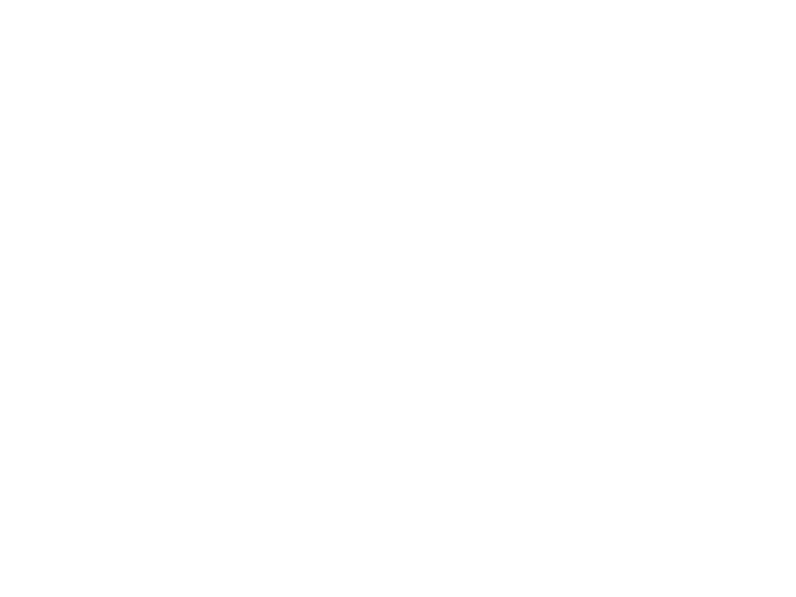

# M.R. AI Agent

An open, synthetic-data prototype of a market-risk manager cockpit. It treats validated risk runs as the source of truth, then adds hierarchy drill-down, explainable charts, scenario analysis, controls, and an auditable Gemini-powered assistant.

## See it in action

Run the app locally, or deploy the repository free on [Streamlit Community Cloud](https://streamlit.io/cloud).




## Main functions

- **Risk cockpit:** portfolio, trading-desk, book, and business-line hierarchy with date and run controls.
- **VaR, P&L and sensitivities:** historical VaR/SVaR, P&L attribution, PLA indicators, and IR/FX risk-factor views.
- **Stress and controls:** historical, hypothetical, adverse, and extreme scenarios with limits, consumption, warnings, and breaches.
- **Scenario Lab:** change a shock and see the deterministic stressed P&L/risk response immediately.
- **Ask M.R. AI Agent:** ask questions over the selected risk run; answers cite the underlying deterministic tools and can be audited.

## Run locally

```powershell
cd "C:\FG\Market Risk AI"
python -m venv .venv
.\.venv\Scripts\Activate.ps1
pip install -r requirements.txt
Copy-Item .env.example .env
# Add your own GEMINI_API_KEY to .env
python -m streamlit run streamlit_app.py
```

The app opens at `http://localhost:8501`. For Streamlit Cloud, select `streamlit_app.py` as the main file and add `GEMINI_API_KEY` under App settings → Secrets. Never commit a real key.

## Project layout

```text
streamlit_app.py                 tiny deployment entrypoint
market_risk_dashboard_v29.py     current Streamlit dashboard
market_risk_agent_v29.py         current agent API
data/                             synthetic risk-run data
archive/versions/                 earlier versions, retained for history
docs/                             references and README screenshots
```

## Data and scope

The included data is synthetic and intentionally small. This is a demonstrator, not a production risk engine, official bank architecture, investment advice, or a substitute for independent model validation. Replace the data adapter and configure governance before using any real data.

## Version update log

- **V29:** Scenario Lab with deterministic what-if shocks and audit trail; deployment-ready entrypoint.
- **V28:** compact curve sensitivity tables, IR Vega surfaces, and cleaner Stress/Ask-agent presentation.
- **V27:** VaR movement attribution and improved P&L explain visualisation.
- **V26:** hierarchy filters, governance controls, and risk-factor limits.
- **V25:** tenor-aware sensitivities across currencies and curve families.
- **V24:** hierarchy exploration and transparent synthetic allocations.
- **V23:** daily/weekly/monthly VaR movement context.
- **V22:** VaR movement attribution foundation.
- **V21:** Scenario Lab foundation and stress categories.
- **V20:** daily risk brief and workflow foundations.
- **V19:** portfolio aggregation and risk-run comparison foundations.
- **V18:** P&L explain and explained/unexplained controls.
- **V17:** limits and governance across risk factors.
- **V16:** sensitivities tab (IR Delta/Gamma/Vega, FX Delta, Theta).
- **V15:** trade → book → trading desk → business-line hierarchy.
- **V14 and earlier:** ingestion, deterministic analytics, memory, and initial dashboard iterations (see `archive/versions/`).

