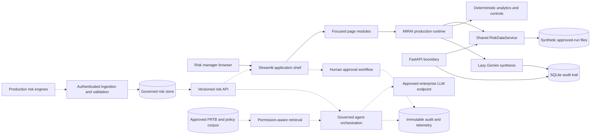

# Architecture

## Current V33 and target direction

Solid connections are implemented in this repository. The public Streamlit process calls the shared Python service directly; FastAPI exposes the same validated data service for future clients. Dashed connections are production requirements, not claims about the demo.

## Component responsibilities

| Component | Responsibility | Status |
|---|---|---|
| `streamlit_app.py` | Minimal deployment entrypoint | Implemented and publicly hosted |
| `mirai/ui/app.py` | Shared filters, navigation and page dispatch | Implemented |
| `mirai/ui/pages/` | Focused Dashboard, VaR, P&L, sensitivities, stress, scenario, controls, governance and agent renderers | Implemented |
| `mirai/runtime.py` | Single public analytics/agent API imported by the dashboard | Implemented |
| `mirai/risk_service.py` | Validate and select approved risk-run data for Streamlit and FastAPI | Implemented |
| `mirai/core.py`, `controls.py`, `stress.py`, `sensitivities.py`, `scenario.py` | Deterministic calculations and governed data contracts | Implemented |
| `mirai/agent.py` | Lazy Gemini synthesis over deterministic evidence | Implemented |
| `mirai/audit.py` | One SQLite event mechanism used by API and agent investigations | Implemented for demonstration |
| `mirai/book_risk.py` | Generate explicit synthetic book/date facts, aggregate scopes and reconcile totals | Implemented |
| `mirai/api.py` | Typed health, summary, breach, scenario, query and audit endpoints | Implemented; not separately hosted |
| RAG and graph orchestration | Retrieve approved rules and enforce tool sequence, retries and approvals | Planned only |
| Enterprise identity/data platform | SSO, RBAC, entitlements, encryption, retention and monitoring | Required before real-data use |

## Consolidation and rollback controls

- Active modules never import `archive.versions`; CI tests enforce this boundary.
- Static data is cached and the Gemini client is created only after a user submits a question.
- Python 3.12 and production dependencies are pinned for reproducible builds.
- `v32-stable` preserves the last pre-consolidation build; V30 and V31 also retain stable tags.
- The V32 source files remain unchanged as readable rollback artefacts.

## Design principles

- Curated risk results are the numerical source of truth.
- The LLM explains deterministic evidence and cannot change limits, status or severity.
- The hierarchy filter changes the data perimeter before analytics are calculated.
- UI, risk calculations, synthesis and audit storage remain separable.
- Production deployment should place authenticated APIs, entitlements and durable audit infrastructure between users, risk data and model endpoints.
