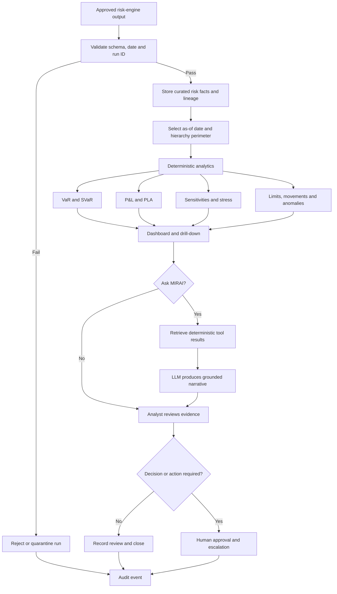

# Functional specification and workflow

## Product boundary

MIRAI consumes approved market-risk results; it does not price trades. The current consolidated V33 demo uses synthetic data covering 260 business dates and 20 books. The reporting hierarchy is book → trading desk → business line → whole bank.

## Core functions

| Area | Required behaviour | Current status |
|---|---|---|
| Ingestion and validation | Accept dated risk results, validate required fields/business dates and retain run lineage | Implemented for the synthetic CSV; API ingestion is not yet implemented |
| Hierarchy aggregation | Filter and aggregate P&L, component VaR/SVaR, stress and limits by book, desk and business line | Implemented with explicit synthetic book/date records |
| Dashboard | Summarise current P&L, HVaR, SVaR, ES, sensitivities, stress and attention points | Implemented |
| Investigation | Show movements, attribution, PLA indicators, backtesting and limit consumption | Implemented as deterministic demo analytics |
| Scenario Lab | Apply user-defined rate, FX and volatility shocks and show estimated P&L decomposition | Implemented as an approximation, not full revaluation |
| Ask MIRAI | Answer questions using deterministic tool evidence and selectable detail | Implemented with Gemini when configured |
| Controls and audit | Classify limits, show lineage, reconcile totals and record API events | Implemented; immutable production audit storage is not |
| Knowledge retrieval | Cite approved FRTB and internal-policy passages | Planned; no production RAG corpus yet |
| Human workflow | Assign, comment, approve and close findings | Rules defined; persistent workflow UI is planned |

## Main workflow

## Functional rules

1. Every result must carry an as-of date, run ID, reporting currency and hierarchy scope.
2. Risk figures come from supplied data or deterministic calculations. The LLM must not invent or recalculate official figures.
3. Warning begins at 80% limit consumption and breach at 100%, unless an approved mandate specifies otherwise.
4. Negative stress P&L represents loss versus the base valuation.
5. Scenario Lab output remains labelled as an approximation and separate from official revaluation.
6. V33 book HVaR/SVaR are parent-portfolio contributions, not standalone VaR measures.
7. Failed validation prevents a run from being presented as approved.
8. Any decision affecting limits, escalation closure, capital treatment or trading requires human approval.

Quantitative acceptance criteria are in [Business problem and target users](business-problem-and-target-users.md#success-criteria).

